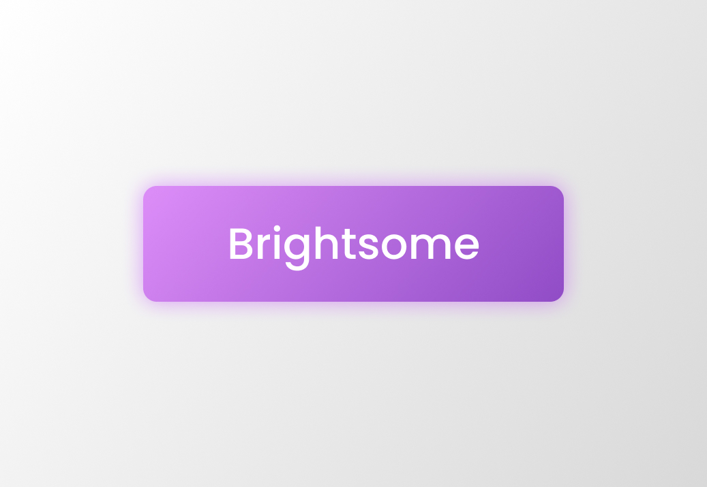

Brightsome is a lightweight CSS and JS library to develop cool and modern designs in web pages quickly and easily.

## Features

Brightsome is based on the best looking design patterns. It's a concrete implementation of the neumorphic design and aims to provide a cool user interface that is also simple to use.

Most relevant features:
- cool design
- user friendly look
- open source

## Usage

Using Brightsome library is super simple. In order to make it work properly the style should be imported alongside the script.

Style import:
```html
<link rel="stylesheet" href="maruchero.github.io/brightsome/latest/style/all.min.css">
```

Script import:

```html
<script src="maruchero.github.io/brightsome/latest/script/all.min.js"></script>
```

More advanced information on imports can be found on the [documentation]().

## Contributing

Before forking and pushing take a look to the repository structure:

- There are two branches:
  - `master`: for documentation about the library and source code in general
  - `deploy`: for processed css and built documentation; deploy branch is hosted in order to make public documentation and provide importable code. Also see [building](#building).

- The deploy branch contains some version folders, the `latest` folder shoud be updated every time a new version is released. Each version folder contains three folders:
  - docs: built documentation
  - style: css
  - script: js
  - modules: js but modular

### Installing

This library uses npm as package manager and its primary dependencies are Svelte and Sass.

Installing them is super simple: just need to run this simple command.
```commandline
npm install
```

### Building

The Brightsome library has only two components that need to be built before deploying:
- documentation
- sass (preprocessed css)

This simple command should do all the work.
```commandline
npm run build
```

It is also important to remember to update minified files (`all.min.*`). Learn more about [minification](https://www.imperva.com/learn/performance/minification/).

## Contacts

If you have any question or issue feel free to contact the repository maintainers:
- Marcello Garonzi ([marce.gnz303@gmail.com](mailto:marce.gnz303@gmail.com))
